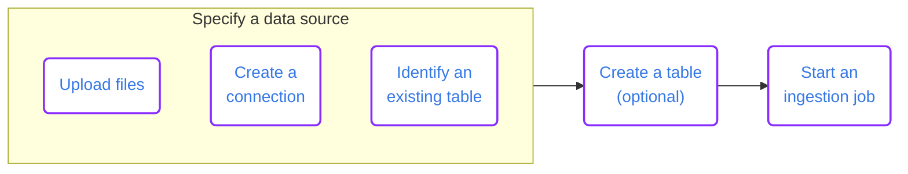
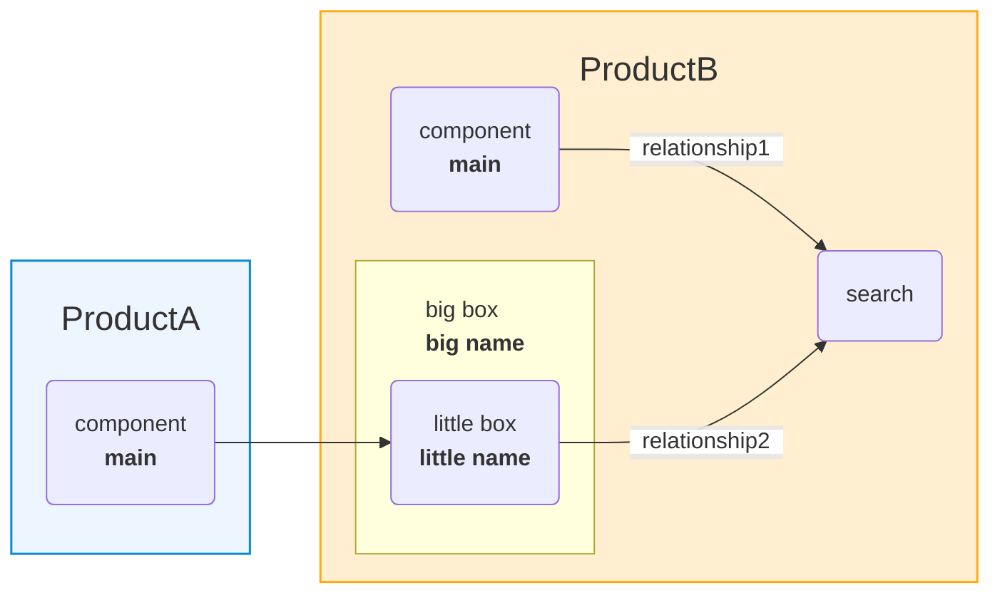

# Linear flow of steps

https://docs.imply.io/polaris/ingestion-guide-event-hubs

# Linear flow with different environments

https://docs.imply.io/polaris/ingestion-overview/

# Relationship diagram

